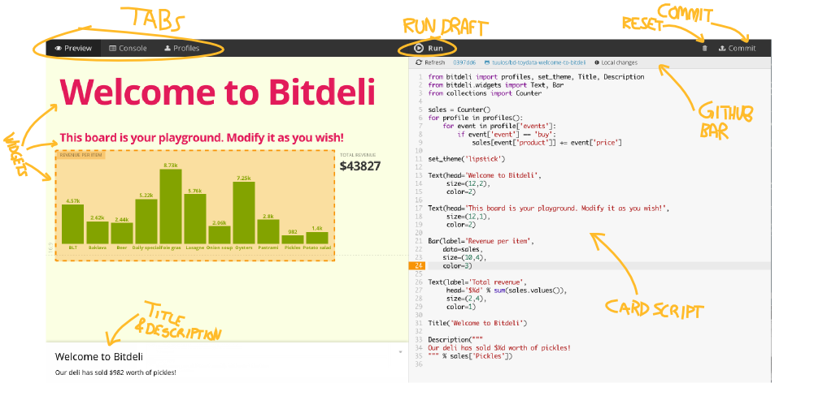

.. _editor:

Card Editor
===========

The card editor allows you to develop :ref:`card scripts <card-script>` in the same way
as you develop code on a local computer. You can edit, test and debug a fully functional
Python program without leaving the browser.

The main benefit of using the Card Editor compared to a local computer is that it allows
you to test and debug analytics with live production data. To ensure that you
can develop code rapidly regardless of the amount of data, the editor picks
:ref:`a random sample <sampling>` of :ref:`profiles` automatically.

How it Works
------------

1. The **card script** can contain any Python code. The interface to inputs and outputs is provided by  the :ref:`bitdeli-py` module.

2. The input for the card script are the :ref:`profiles`. You can view them by clicking the **Profiles tab**.

3. You can test the code any time by clicking **Run**. This executes the code for a random sample of profiles to ensure that the draft run finishes quickly.

4. If something went wrong with the draft run, you would see an error message in the **Console tab**. Also messages written to the standard output, like ``print "hello world"``, appear in the console.

5. The script produces a dashboard that is shown in the **Preview tab**. The dashboard is made of :ref:`bitdeli-widgets`, such as text fields and a bar chart above. In addition, the script may generate **a title and a description** for the card based on the profiles. Note that you can click a **widget** to highlight the line that produced it.

6. Any changes in the code are saved automatically, so you can freely exit the editor and continue editing the code later. However, changes are not applied to the card until you click **Commit**. You can discard changes and return to the previous committed version by clicking the **Reset** icon. Only after you have committed the changes the code is run for all the profiles.

7. The editor is tightly integrated to GitHub, which enables many advanced use cases from local editing to sharing and collaboration. The integration is managed on the **GitHub bar**. For more information, see :ref:`github`.

.. _sampling:

Sampling
--------

The secret weapon of the Card Editor is sampling. Instead of having to wait for minutes or hours for a local machine or a MapReduce job to crunch through all the data, the editor returns results more or less instantly regardless of the amount of data, thanks to sampling.

When you click run, the editor runs the code for a random sample of :ref:`profiles` if there are more than 10,000 profiles in total. You can find out the number of profiles in the profiles tab. Otherwise sampling is disabled and the code is executed for all the profiles.

A random sample is generated when you open the editor. This means that the inputs of a draft run won't change during an editor session. You can get a new random sample by refreshing the page in your browser.

Note that when you start editing a card for the first time, the initial results from draft runs may not be based on an unbiased sample. The sample will become unbiased after a few minutes automatically.

Due to sampling results produced by a draft run do not always accurately represent the final results shown on the card. Only after you have committed your changes, the code is run for all the profiles.
Sampling is meant to aid development, not to be used as a tool for rigorous analytics as such.

