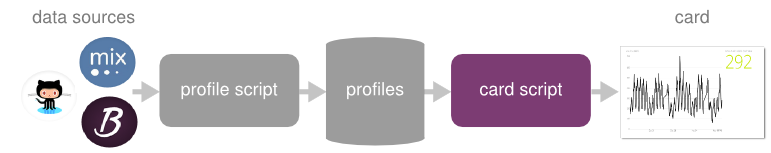

.. |trade|  unicode:: U+02122
   :trim:

.. _overview:

Technical Overview
==================

Bitdeli in 30 seconds
---------------------

Bitdeli is based on a simple conceptual model of computation: Each **card** is backed by a big database
that stores data about the users of your service. All data related to a user is stored in a single
row in the database, which is called **a profile**.

The **card script** is where the actual analytics is perfomed. The script scans through all the user
profiles in the database. It can aggregate, filter or process the profiles in any way you like
but it can't write to the profile database. The script outputs a textual summary and a visualization of
the results as a set of **widgets**.

The card script is automatically executed every time the profile database changes, so the card
is always up to date.

That's it. You are ready to start hacking!

Bitdeli in 5 minutes
--------------------

This is what happens under the hood.

Input Data
''''''''''

Bitdeli is based on a schemaless, event-based data model. The atomic unit of input data
is an arbitrary `JSON <http://json.org>`_ object.

One field in the object identifies the user who produced the event. Events are
partitioned to profiles based on this field, which depends on the data source.

Bitdeli can pull data from supported 3rd party services on regular intervals. The
pull data sources are specified in the user's `account settings </settings/data>`_.

Bitdeli also provides a :ref:`push-api` that allows events to be sent directly to
Bitdeli over HTTPS.

Regardless of the source, the raw events are stored in
`Amazon Simple Storage Service <http://aws.amazon.com/s3/>`_ from where they are
read for further processing. The raw events are never modified.

Profile Script
''''''''''''''

The profile script updates the profiles based on raw events. It is executed once for
every new batch of events.

In the simplest case, the profile script can store raw events as such in the profile.
As manipulating raw events tends to be unnecessarily tedious for the developer, as well
as bad for scalability, the profile script typically aggregates events in various ways.

As the contents of raw events are intimately tied to the data source, the profile script
is specific to a data source. Correspondingly, a card script is intimately tied to the
contents of profiles, hence it defines the desired profile script in its
``bitdeli/config.json`` configuration file.

All available profile scripts are documented in detail in :ref:`profile-scripts`.

Profiles
''''''''

Card Script
'''''''''''

Motivation
----------

Bitdeli is designed to maximize developer productivity - and to make sure that anyone can easily become a Bitdeli developer.

The guiding principles behind the design of Bitdeli are based on over ten years of practical experience on building and using analytics platforms. They are summarized below.

The Zen of Bitdeli
''''''''''''''''''

1. When you need to Get Stuff Done Fast |trade|, nothing beats a popular,
   general-purpose programming language like `Python <http://python.org>`_.

2. Simple ad-hoc scripts suck for data processing but every other system sucks worse. Every
   minute spent to learn `NoSQL <en.wikipedia.org/wiki/NoSQL>`_, `MapReduce <en.wikipedia.org/wiki/MapReduce>`_ or any other new paradigm is a minute less spent on building actual analytics.

3. Everybody should be able to get their hands dirty with data - it shouldn't require black magic. The domain experts are rarely experts in scalable data processing.

4. Make it easy to experiment with data. Every answer raises new questions.

5. Never throw away raw data. Make it easy to return to the ground truth.

Backend
'''''''

Bitdeli is powered by a custom stream processing backend that is specifically designed for
flexible user-centric analytics. The central design principle was to support
unrestricted, standard `Python <http://python.org>`_ as a query language without
sacrificing scalability.

The backend is written in `Erlang <http://erlang.org>`_, a programming language that has been used for decades to build highly-available, scalable systems.

Bitdeli lives in the `Amazon Cloud <http://aws.amazon.com>`_. The backend allocates servers and storage space dynamically based on the actual load. This allows us to handle large amounts of data and demanding computation.

For more technical details, see `Bitdeli at weusethat.com <http://weusethat.com/bitdeli/>`_.
