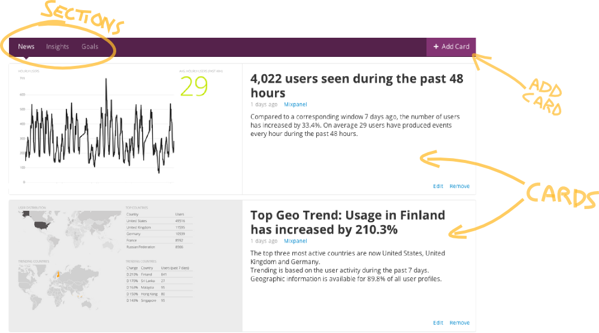

.. include:: <isonum.txt>
.. _what-is-bitdeli:

What is Bitdeli
===============

Bitdeli is like Build Your Own Sandwich for analytics: You can mix, match and customize a perfect dish of metrics for your taste.

Bitdeli can process data from various data sources: Events can be sent directly to Bitdeli from a web or mobile application or Bitdeli can fetch them automatically from a 3rd party service, such as `Mixpanel <https://mixpanel.com>`_.

Depending on the data source, Bitdeli provides a growing selection of ready-made solutions for typical analytics tasks, such as tracking growth, estimating churn etc. The key difference to other analytics services is that Bitdeli allows you to customize the solutions with plain and simple `Python <http://python.org>`_ code - or you can create new metrics from scratch.

You can use Bitdeli to create real-time dashboards and reports, or you can use it as a safe and scalable way to experiment with your data. Bitdeli is a powerful tool for trying out new metrics and rapidly iterating analytics as requirements change.

How Bitdeli works
-----------------

Bitdeli organizes analytics around the concept of **a card**. A card can show where your business is going or what your users are doing - anything based on your data.

A card is a small analytics machine: It ingests real-time data from one of the connected data sources, processes it based on **a card script** written in Python and outputs a dashboard and a snippet of text. You can hang a card on the wall and use it as a traditional dashboard. Alternatively you can focus on the text and use it as an automatically updating mini-report.

Since each card is powered by a full-fledged Python script, they can perform arbitrarily sophisticated analytics: Anything from simple averages to state-of-the-art machine learning. The good news is that you don't need to be a data scientist to be able to use them. You can start using a card just by clicking **Add card** and choosing a card that seems interesting.

If the newly added card doesn't quite fit to your needs, or you don't like the colors, click **Edit**. This opens the in-browser **Card Editor** that allows you to customize and test the card with your actual data. Using the editor doesn't require any special expertise besides the basics of Python.

All analytics in one place
--------------------------

Typically a card gives answer to one specific question, such as how many users signed up last week or what is our average revenue per user. As a whole, your collection of cards can provide a complete view to your data at a glance.

To make it easier to find and organize cards, Bitdeli categorizes them into three **sections**: News, Insights and Goals.

Cards in the *News* section answer the question "What is happening right now?", focusing on the present. Cards in the *Insights* section provide a deeper dive into your historical data, answering the question "What lead us here?". Finally, the *Goals* section makes analytics actionable by helping you to set and track concrete goals for improvement.
